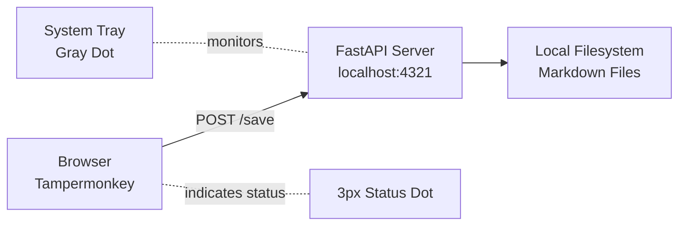

<div align="center">

# 🤫 Silent AI Archiver

**Zero-Interaction AI Conversation Archive Tool**

[](https://opensource.org/licenses/MIT)
[](https://www.python.org/downloads/)
[](https://github.com/yourusername/silent-ai-archiver)

*Automatically archive your ChatGPT and Gemini conversations to Markdown files — completely hands-free.*

[Features](#-features) • [Installation](#-installation) • [How It Works](#-how-it-works) • [Documentation](#-documentation) • [Contributing](#-contributing)

</div>

---

## 🎯 The Problem

Ever wanted to save your AI conversations for reference, but found manual copy-pasting tedious? Traditional archiving methods require constant manual intervention, breaking your workflow.

## 💡 The Solution: Zero-Interaction™

**Silent AI Archiver** runs invisibly in the background. Once set up, it automatically saves every conversation — no buttons to click, no shortcuts to remember, no workflow interruption.

> **"Set it and forget it."** Your conversations are safely archived while you focus on what matters.

---

## ✨ Features

### 🔇 Zero-Interaction Design
- **No Manual Saves** — Conversations are automatically captured
- **Smart Debouncing** — Waits 5 seconds after typing stops to avoid partial saves
- **Lifecycle Hooks** — Saves on tab close and conversation switches
- **Invisible Operation** — No console windows, just a tiny 3px status indicator

### 🚀 Technical Highlights
- **🎨 Minimal UI** — 3-pixel status dot (🟢 success, 🟡 waiting, 🔴 error)
- **📝 Markdown Export** — Clean, readable format with YAML frontmatter
- **🔄 Smart Overwrite** — Always keeps the latest version of each conversation
- **⚡ Lightweight** — Local-first, no cloud dependencies
- **🔒 Private** — All data stays on your machine

### 🌐 Platform Support
- ✅ **ChatGPT** (chatgpt.com)
- ✅ **Gemini** (gemini.google.com)
- ✅ **Claude** (claude.ai)
- 🔜 **Poe** (extensible architecture)

---

## 📦 Installation

### Prerequisites
- Python 3.10+
- Windows OS (macOS/Linux support coming soon)
- [Tampermonkey](https://www.tampermonkey.net/) browser extension

### Quick Start

1. **Clone the repository**
   ```bash
   git clone https://github.com/yourusername/silent-ai-archiver.git
   cd silent-ai-archiver
   ```

2. **Install dependencies**
   ```bash
   pip install -r requirements.txt
   ```

3. **Build the executable**
   ```bash
   build.bat
   ```

4. **Run the backend**
   ```bash
   dist\SilentArchiver.exe
   ```
   ✅ Check your system tray for a gray dot icon

5. **Install the browser script**
   - Open Tampermonkey dashboard
   - Create new script
   - Copy contents from `userscript/silent_archiver.user.js`
   - Save and enable

6. **Start archiving!**
   - Visit ChatGPT or Gemini
   - Chat normally — your conversations are being saved automatically

---

## 🛠️ How It Works

### Architecture Overview



### The Magic: Zero-Interaction Flow

1. **DOM Monitoring** — `MutationObserver` watches for new messages
2. **Smart Debouncing** — Waits 5s after last change to avoid saving mid-response
3. **Auto-Save Triggers**:
   - ⏱️ Conversation idle for 5 seconds
   - 🚪 Tab/window closing
   - 🔀 Switching to different conversation
4. **File Management** — Same conversation = overwrites file (always latest version)

### File Organization

```
📁 ~/Documents/AI_Memory_Archive/
├── 📅 2026-02-06/
│   ├── 📄 ChatGPT_How to Learn Python.md
│   └── 📄 Gemini_Data Analysis Tips.md
└── 📅 2026-02-07/
    └── 📄 ChatGPT_...
```

**File Format**:
```markdown
---
platform: ChatGPT
title: How to Learn Python
last_updated: 2026-02-06 16:30:45
---

**User:**
How do I quickly learn Python?

---

**Assistant:**
Here are some tips for learning Python...
```

---

## 📖 Documentation

### Status Indicator

The 3px dot in the top-right corner shows:
- 🟢 **Green** — Last save successful
- 🟡 **Yellow** — Waiting / saving in progress
- 🔴 **Red** — Backend not running (start `SilentArchiver.exe`)

### System Tray Menu

Right-click the tray icon:
- **Open Archive Folder** → Quick access to saved files
- **Exit** → Close the application

### Configuration

**Change save location**: Edit `ARCHIVE_ROOT` in `src/main.py`
```python
ARCHIVE_ROOT = Path.home() / "Documents" / "AI_Memory_Archive"
```

**Adjust debounce delay**: Edit `DEBOUNCE_DELAY` in `userscript/silent_archiver.user.js`
```javascript
const DEBOUNCE_DELAY = 5000; // milliseconds
```

---

## 🧪 Testing

Run the API test suite:
```bash
python test_api.py
```

Expected output:
```
[测试] /health 端点...
[成功] 后端服务运行正常
   响应: {'status': 'running'}

[测试] /save 端点...
[成功] 保存成功
   文件路径: C:\Users\...\AI_Memory_Archive\...
```

---

## 🤝 Contributing

We welcome contributions! See [CONTRIBUTING.md](CONTRIBUTING.md) for guidelines.

**Quick Links**:
- 🐛 [Report a Bug](https://github.com/yourusername/silent-ai-archiver/issues/new?labels=bug)
- 💡 [Request a Feature](https://github.com/yourusername/silent-ai-archiver/issues/new?labels=enhancement)
- 🌐 [Add Platform Support](CONTRIBUTING.md#adding-new-platforms)

---

## 🗺️ Roadmap

- [x] Claude.ai integration
- [ ] macOS and Linux support
- [ ] Poe.com support
- [ ] Poe.com support
- [ ] Search functionality across archives
- [ ] Export to PDF/HTML
- [ ] Configurable backup/compression
- [ ] Multi-language UI

---

## ❓ FAQ

<details>
<summary><b>Why is the status dot red?</b></summary>

The backend isn't running. Make sure `SilentArchiver.exe` is active in your system tray.
</details>

<details>
<summary><b>Can I use this with other AI platforms?</b></summary>

Yes! The architecture is extensible. See [CONTRIBUTING.md](CONTRIBUTING.md#adding-new-platforms) for how to add new platforms.
</details>

<details>
<summary><b>Where is my data stored?</b></summary>

All conversations are saved locally in `~/Documents/AI_Memory_Archive/`. Nothing is sent to the cloud.
</details>

<details>
<summary><b>Will this slow down my browser?</b></summary>

No. The script uses efficient DOM monitoring and debouncing to minimize performance impact.
</details>

---

## 📄 License

This project is licensed under the MIT License - see the [LICENSE](LICENSE) file for details.

---

## 🙏 Acknowledgments

Built with:
- [FastAPI](https://fastapi.tiangolo.com/) — Modern Python web framework
- [Pystray](https://github.com/moses-palmer/pystray) — System tray integration
- [PyInstaller](https://www.pyinstaller.org/) — Python to executable packaging

---

<div align="center">

**Enjoy zero-interaction archiving!** 🚀

[⬆ Back to Top](#-silent-ai-archiver)

</div>
